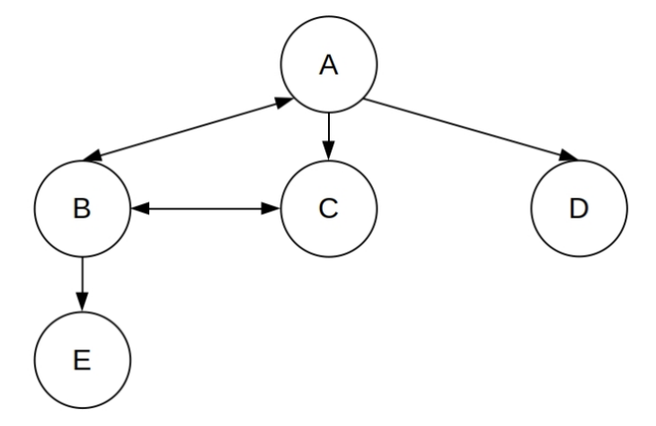
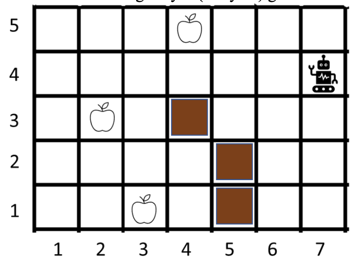

# AI-Search-Problems
This project uses several Artificial Intelligence search algorithms (informed and uninformed) to solve given problems.


## ⚙️ Technologies


## 🔍 Search Algorithms

- Best-First-Search
- Breadth-First-Search
- Uniform-Cost-Search
- Depth-Fist-Search
- A-Star-Search
- Greedy-Search

Note: all search algorithms are applied in tree-like and graph-like


## ⚡ Heuristics

- <b>Manhattan distance:</b> |x1 - x2| + |y1 - y2|
- <b>Eucledian distance:</b> √(∑i=1N (pi-qi)²)


## ❓ Problems

- <b>Route Problem: </b> Route-finding task
Given knowledge of direct rail connections, what's the shortest rail itinery which gets you from A to E?
In this problem, action sequences form a tree structure.
At some given point, certain actions are possible.
These actions take you to new points.
At each of those new points, more actions are possible.
And so on.
At each point the possible actions form a branch.
Joining up the branches gives you a tree.

    

    Heuristic:  Eucledian distance

<br>

- <b>Grid Problem: </b> A grid problem instance consists of an N-by-M grid (N rows and M columns). Some grid locations contain walls that the agent
cannot move into; we will use a list of locations wall_coords to store these wall locations. Some grid locations contain food
that the agent can consume food_coords. The agent starts at some grid location (xA, yA). The agent can move left, right, up,
and down one grid. The agent cannot move outside the bounds of the N-by-M grid. The goal is to consume all food on the grid.
With this formulation, we need to keep track of which food was eaten. So, a state is a tuple of two elements: the current location
(xA, yA) of the agent, and a Boolean tuple food_eaten of the same size as food_coords where food_eaten[i]
indicates if food_coords[i] was eaten (true) or not (false). Initially, this tuple should be set to false (all food not eaten at
start).

    

    The agent is in (7, 4). The walls are at [(4,3), (5,1), (5,2)]. The food are at [(3,1), (2,3), (4,5)]

    Heuristic: Manhattan distance


## 🔧 Installation

1. Install newest version of [Python](https://www.python.org/)
2. Run ```test_runner.py```

## ✒️ Author

| [<br><sub>@M-Alhassan</sub>](https://github.com/M-Alhassan) |
| :---------------------------------------------------------------------------------------------------------------------------: |# AI-Search-Algorithms-Application
